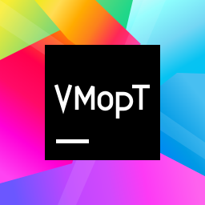

<p align="center">
  
</p>

# vmoptions Tuner

**Version: 1.0.1** · [English](#english) · [Русский](#русский)

## English

A Windows 11 application that edits JetBrains `.vmoptions` files and restores your
assigned JVM options after IDE updates. Built with Python and WinUI 3 (PyWinRT).
The interface supports English and Russian. English is selected on first launch;
use **ENG | RUS** in **Settings** to switch languages instantly.

Supports current and legacy JetBrains products, Android Studio, MPS, Gateway and
JetBrains Client. Each product can be bound to a manually selected `.vmoptions` file.

### Installation and launch

1. Download the ZIP asset from [the latest release](https://github.com/DragonSavA/JBvmotionsTuner/releases/latest),
   or [download the project ZIP](https://github.com/DragonSavA/JBvmotionsTuner/archive/HEAD.zip)
   using **Code → Download ZIP** on GitHub, or clone the repository:

   ```powershell
   git clone https://github.com/DragonSavA/JBvmotionsTuner.git
   ```

2. Extract the **entire** ZIP into a folder you can write to, such as
   `C:\Tools\JBvmotionsTuner`. Keep all files and folders together; running directly
   inside the ZIP will not work.
3. Open that folder and double-click **`start.bat`**. An IDE and a preinstalled
   Python are not required. Internet access is needed to download missing dependencies.
4. Wait for setup to finish. The application window then opens. If Windows asks for
   permission to install a prerequisite, complete the installation.

The launcher performs the following checks on every run:

- Reuses the project’s compatible `.venv`, or searches `PATH`, the Python launcher /
  Python Install Manager and Windows’ Python registrations for standard
  **CPython 3.13 or newer**. It chooses the newest usable installed interpreter.
  Store Python runtimes and experimental free-threaded builds are excluded;
  runtimes installed by Python Install Manager are supported.
- If no suitable interpreter is available, installs CPython 3.13 for the current
  user through WinGet. If WinGet is unavailable or fails, it downloads an official
  python.org installer and verifies its digital signature.
- Creates `.venv` beside `start.bat`; dependencies go into this environment.
  An incompatible or broken existing `.venv` is preserved as `.venv.backup-…`
  before a replacement is created.
- Checks every dependency in `requirements.txt`, installs missing or incompatible
  packages, and checks their consistency. It also checks and, if necessary,
  installs the **Windows App Runtime release required by the installed PyWinRT**.
  The fallback runtime installer comes from Microsoft and its signature is checked.
- Creates or updates the **vmoptions Tuner** desktop shortcut when its setting is
  enabled. The shortcut launches `start.bat` and uses the application’s icon.

After setup, already satisfied Python dependencies need no download. To launch
again, use the desktop shortcut, double-click `start.bat`, or run:

```powershell
python "C:\Tools\JBvmotionsTuner\main.py"
```

Direct launch automatically uses the `.venv` prepared by `start.bat`, even if your
shell selects another Python installation. If you skip the batch setup entirely,
use CPython 3.13+ with `requirements.txt` installed and a compatible Windows App
Runtime. See the [Python Windows documentation](https://docs.python.org/3/using/windows.html)
and [Windows App Runtime deployment guide](https://learn.microsoft.com/en-us/windows/apps/windows-app-sdk/deploy-unpackaged-apps).

If setup installed Python, open a new terminal before using the `python` command
so it picks up the updated user `PATH`.

### First use and settings

1. Under **IDEs and files**, select a product and choose its `.vmoptions` file manually.
   The application does not search for IDE installations.
2. Under **Option sets**, create an option set, enter one option per
   line, and assign it to one or more IDEs. Every nonempty line must start with `-`;
   duplicate lines are removed. Each IDE belongs to at most one set.
3. Use **Synchronize all** or select an IDE in the editor and synchronize its
   file. Missing assigned lines are appended. Existing options are kept.

The editor shows the full file, highlights assigned lines in green and warns about
missing lines and unsaved edits. Save or discard manual edits before synchronizing.
There is also a button to add `-Didea.ignore.plugin.compatibility=true` to a set.

Both startup options are enabled by default and work independently:

| Setting | Enabled | Disabled |
| --- | --- | --- |
| **Autostart** | Runs one silent synchronization when you sign in to Windows. | Removes the app’s current-user Run registration. |
| **Desktop icon** | Creates a desktop shortcut to `start.bat`. | Removes that shortcut and remembers your choice across launches. |

**Language — ENG | RUS** changes labels, hints, validation messages and the file
picker immediately. Your choice is saved between launches. Switching languages
preserves unsaved IDE associations, option sets and file edits.

The desktop shortcut setting also applies to a redirected / OneDrive desktop.
Removing the shortcut never prevents launching through `start.bat` or `main.py`.
While enabled, a missing shortcut is restored on the next launch. You can also
select the system, light or dark theme and set an accent colour as `#RRGGBB`.

The GitHub icon next to the version opens the project repository. The footer
credits **DragonSavA with Codex**; clicking **DragonSavA** opens the author's GitHub
profile. The credit follows your selected interface language.

### Files, updates and limitations

- Settings, language, IDE paths, option sets and the desktop shortcut preference are stored
  in `%LOCALAPPDATA%\JetBrainsVmoptionsTuner\config.json`, outside the repository.
- Autostart uses
  `HKCU\Software\Microsoft\Windows\CurrentVersion\Run\JetBrainsVmoptionsTuner`
  and launches `pythonw.exe main.py --background` using absolute paths.
- Keep the project in its final location. After moving it, run `start.bat` in the
  new location and switch autostart off and on to refresh its registered paths.
  If the old shortcut remains on your desktop, launch the moved batch file directly.
- To update, replace the project files in the same folder and run `start.bat` again.
  Keep your `.venv`; the launcher will check dependencies. Your settings stay in
  Local AppData. `1.0.0` also reads configurations from earlier versions;
  configurations without a language preference use English.
- The application runs with your current permissions. Pick a `.vmoptions` file you
  can write to; no permissions are elevated to edit IDE files. Synchronization
  preserves UTF-8 BOM, CRLF/LF and the original ANSI encoding.
- Background synchronization runs once at sign-in. During a session, use manual
  synchronization or reopen the application; there is no continuous file watcher.
- Restoring a required line does not remove competing options elsewhere in the
  file. Check the final JVM options, especially repeated memory settings, yourself.

To run a silent synchronization manually after setup:

```powershell
python "C:\Tools\JBvmotionsTuner\main.py" --background
```

### Development and verification

Open the folder in PyCharm and select `.venv\Scripts\python.exe` as the interpreter
after running `start.bat`. Alternatively, create your own CPython 3.13+ environment
and install `requirements.txt`.

```powershell
.\.venv\Scripts\python.exe -m unittest discover -s tests -v
powershell -NoProfile -ExecutionPolicy Bypass -File tests\test_launcher.ps1 -PythonExecutable "$PWD\.venv\Scripts\python.exe"
.\start.bat -PrepareOnly
```

Core tests also run outside Windows; Windows shell tests are skipped there.
`-PrepareOnly` checks prerequisites and applies the desktop shortcut preference
without opening the window. The remaining UI checks are in
[WINDOWS_VERIFICATION.md](WINDOWS_VERIFICATION.md).

### Continuous integration and releases

[`.github/workflows/release.yml`](.github/workflows/release.yml) runs automatically
for pushes and pull requests to `master`. It installs dependencies, checks them,
runs all unit tests and Windows integration tests, and verifies the PowerShell
launcher and batch file on Windows with **Python 3.13 and 3.14**.

After both test jobs pass, a push to `master` publishes a source ZIP and its
SHA-256 checksum in [GitHub Releases](https://github.com/DragonSavA/JBvmotionsTuner/releases).
The archive is made with `git archive` from the tested commit, with a single
`JBvmotionsTuner-<version>/` top-level folder. Local environments and untracked
files are excluded. Each commit gets a separate tag, `v<version>-<12-character SHA>`;
rerunning the same commit refreshes its assets. Only the current `master` commit
can be marked as the latest release, so an older run cannot replace it.
Pull requests run tests without publishing. You can also run the workflow manually
from the **Actions** tab; publication is available for `master`.

The workflow uses GitHub's automatic `GITHUB_TOKEN`; no personal token or additional
repository secrets are needed. Only the release job receives `contents: write`.
The interactive WinUI smoke test remains a local check described in
[WINDOWS_VERIFICATION.md](WINDOWS_VERIFICATION.md).

### Application icon and project files

`vmopt.svg` is the original source for the application icon. To regenerate the
multi-size Windows ICO with Microsoft Edge and Windows’ built-in drawing tools:

```powershell
powershell -NoProfile -ExecutionPolicy Bypass -File scripts\build_icon.ps1
```

| File / folder | Purpose |
| --- | --- |
| `start.bat`, `scripts/launch.ps1` | Python discovery, environment setup and launch |
| `main.py`, `bootstrap.py` | Direct/background entry point and prerequisite checks |
| `ui.py`, `main_window.xaml` | WinUI 3 interface |
| `localization.py` | English and Russian translations and UI bindings |
| `.github/workflows/release.yml`, `scripts/build_release.py` | Windows CI and source ZIP publication |
| `desktop_shortcut.py`, `autostart.py` | Desktop shortcut and sign-in registration |
| `sync.py`, `config.py`, `background.py` | File synchronization, settings and silent execution |
| `catalog.py`, `assets/` | Product catalogue, product icons and the application icon |

### License and trademarks

Application code and the original **VMopT** icon are covered by the [MIT license](LICENSE).
Product icons have separate terms listed in
[assets/README.md](jetbrains_vmoptions_tuner/assets/README.md).

Copyright © 2026 JetBrains s.r.o. JetBrains product names and logos are trademarks
of JetBrains s.r.o. Android Studio and its logo are trademarks of Google LLC.
Other trademarks belong to their respective owners. Product icons are used to
identify their products. This independent project is not affiliated with,
endorsed by or sponsored by JetBrains, Google or other trademark owners.

## Русский

Приложение для Windows 11, которое редактирует файлы `.vmoptions` продуктов
JetBrains и восстанавливает назначенные параметры JVM после обновлений IDE.
Написано на Python и WinUI 3 (PyWinRT). Интерфейс поддерживает английский и русский
языки. При первом запуске выбран английский; переключение **ENG | RUS** находится
в блоке **Settings / Настройки** и применяется сразу.

Поддерживаются актуальные и прежние продукты JetBrains, Android Studio, MPS,
Gateway и JetBrains Client. Для каждого продукта `.vmoptions` выбирается вручную.

### Установка и запуск

1. Скачайте ZIP-архив из [последнего релиза](https://github.com/DragonSavA/JBvmotionsTuner/releases/latest)
   или [ZIP проекта](https://github.com/DragonSavA/JBvmotionsTuner/archive/HEAD.zip)
   через **Code → Download ZIP** на GitHub или клонируйте репозиторий:

   ```powershell
   git clone https://github.com/DragonSavA/JBvmotionsTuner.git
   ```

2. Распакуйте **весь** архив в папку, доступную вам на запись, например
   `C:\Tools\JBvmotionsTuner`. Сохраните все файлы и подпапки вместе: запуск изнутри
   ZIP-архива не поддерживается.
3. Откройте эту папку и дважды щёлкните **`start.bat`**. IDE и заранее установленный
   Python не требуются. Для скачивания недостающих зависимостей нужен интернет.
4. Дождитесь завершения настройки — откроется окно приложения. Если Windows
   запросит разрешение на установку необходимого компонента, завершите установку.

При каждом запуске файл проверяет окружение:

- Использует совместимую `.venv` проекта либо ищет обычный **CPython 3.13 или
  новее** в `PATH`, через Python Launcher / Python Install Manager и в регистрациях
  Python в Windows. Выбирает самый новый подходящий установленный интерпретатор.
  Среды Python из Microsoft Store и экспериментальные сборки без GIL исключены;
  среды, установленные через Python Install Manager, поддерживаются.
- Если подходящего Python нет, устанавливает CPython 3.13 для текущего пользователя
  через WinGet. Если WinGet недоступен или установка не удалась, скачивает
  официальный установщик с python.org и проверяет его цифровую подпись.
- Создаёт `.venv` рядом с `start.bat` и устанавливает зависимости в неё. При
  обнаружении несовместимой или повреждённой `.venv` сохраняет её в
  `.venv.backup-…`, затем создаёт новую.
- Проверяет все зависимости из `requirements.txt`, устанавливает недостающие
  или несовместимые пакеты и проверяет их согласованность. Также проверяет и
  при необходимости устанавливает **версию Windows App Runtime, требуемую
  установленным PyWinRT**. Резервный установщик скачивается с сайта Microsoft;
  его цифровая подпись проверяется.
- Создаёт или обновляет ярлык **vmoptions Tuner** на рабочем столе, если настройка
  включена. Ярлык вызывает `start.bat` и использует иконку приложения.

После настройки уже установленные подходящие Python-зависимости не требуют
скачивания. Для следующих запусков используйте ярлык, `start.bat` или команду:

```powershell
python "C:\Tools\JBvmotionsTuner\main.py"
```

Прямой запуск автоматически использует `.venv`, подготовленную `start.bat`, даже
если в вашей оболочке выбран другой Python. Если вы полностью пропускаете настройку
через `.bat`, нужен CPython 3.13+ с установленным `requirements.txt` и совместимый
Windows App Runtime. Подробности:
[Python в Windows](https://docs.python.org/3/using/windows.html) и
[установка Windows App Runtime](https://learn.microsoft.com/en-us/windows/apps/windows-app-sdk/deploy-unpackaged-apps).

Если Python установился во время настройки, откройте новый терминал перед
использованием команды `python`, чтобы он получил обновлённый пользовательский `PATH`.

### Первое использование и настройки

Чтобы использовать русские названия элементов ниже, выберите **RUS** в блоке
**Settings**. Язык сохраняется между запусками. Переключение не сбрасывает
несохранённые связки IDE, наборы строк и правки файлов.

1. В блоке **IDE и файлы** выберите продукт и вручную укажите его `.vmoptions`.
   Автоматического поиска установленных IDE нет.
2. В блоке **Наборы строк** создайте набор, впишите параметры по одному
   на строке и назначьте одну или несколько IDE. Каждая непустая строка должна
   начинаться с `-`; дубликаты удаляются. Одной IDE можно назначить только один набор.
3. Нажмите **Синхронизировать все** либо выберите IDE в редакторе и синхронизируйте
   её файл. Недостающие строки набора добавляются в конец; существующие сохраняются.

Редактор показывает весь файл, подсвечивает назначенные строки зелёным и
предупреждает о недостающих параметрах и несохранённых изменениях. Перед
синхронизацией сохраните или отмените ручные правки. Кнопкой можно добавить в набор
`-Didea.ignore.plugin.compatibility=true`.

Обе настройки запуска изначально включены и работают независимо:

| Настройка | Включена | Выключена |
| --- | --- | --- |
| **Автозапуск** | Выполняет одну тихую синхронизацию при входе в Windows. | Удаляет регистрацию приложения в пользовательском ключе Run. |
| **Иконка на рабочем столе** | Создаёт ярлык, вызывающий `start.bat`. | Удаляет ярлык и сохраняет выбор между запусками. |

Рабочий стол может быть перенаправлен, в том числе в OneDrive — ярлык создаётся
в его фактической папке. Удаление ярлыка не мешает запуску через `start.bat` или
`main.py`. Если настройка включена, удалённый вручную ярлык восстановится при
следующем запуске. Можно выбрать системную, светлую или тёмную тему и акцентный
цвет в формате `#RRGGBB`.

Иконка GitHub справа от версии открывает репозиторий проекта. Внизу окна находится
подпись **«Разработано DragonSavA с помощью Codex»**; нажатие на **DragonSavA**
открывает GitHub-профиль автора. Подпись меняется вместе с языком интерфейса.

### Данные, обновления и ограничения

- Настройки, язык, пути к IDE, наборы строк и состояние тумблера ярлыка хранятся вне
  репозитория: `%LOCALAPPDATA%\JetBrainsVmoptionsTuner\config.json`.
- Автозапуск регистрируется в
  `HKCU\Software\Microsoft\Windows\CurrentVersion\Run\JetBrainsVmoptionsTuner`
  и вызывает `pythonw.exe main.py --background` с абсолютными путями.
- Сразу выберите постоянную папку проекта. После переноса запустите `start.bat`
  из новой папки и выключите/включите автозапуск, чтобы обновить пути в реестре.
  Если на рабочем столе остался старый ярлык, сначала запустите перенесённый `.bat`
  напрямую.
- Для обновления замените файлы проекта в той же папке и снова запустите
  `start.bat`. Сохраните `.venv`: файл запуска проверит зависимости. Настройки
  остаются в Local AppData. Версия `1.0.0` читает конфигурации прежних версий;
  если язык в них ещё не указан, используется английский.
- Приложение работает с вашими текущими правами. Выбирайте `.vmoptions`, доступный
  вам на запись; приложение не повышает права для редактирования файлов IDE.
  Синхронизация сохраняет UTF-8 BOM, CRLF/LF и исходное ANSI-кодирование.
- Фоновая синхронизация выполняется один раз при входе. В течение сеанса
  используйте ручную синхронизацию или откройте приложение заново: постоянного
  наблюдения за файлами нет.
- Восстановление обязательной строки не удаляет конкурирующие параметры в других
  строках файла. Проверяйте итоговые параметры JVM, особенно повторяющиеся
  настройки памяти.

Тихую синхронизацию после установки можно вызвать вручную:

```powershell
python "C:\Tools\JBvmotionsTuner\main.py" --background
```

### Разработка и проверка

После запуска `start.bat` откройте папку в PyCharm и выберите интерпретатор
`.venv\Scripts\python.exe`. Можно также создать своё окружение CPython 3.13+
и установить `requirements.txt`.

```powershell
.\.venv\Scripts\python.exe -m unittest discover -s tests -v
powershell -NoProfile -ExecutionPolicy Bypass -File tests\test_launcher.ps1 -PythonExecutable "$PWD\.venv\Scripts\python.exe"
.\start.bat -PrepareOnly
```

Тесты ядра работают и вне Windows; проверки Windows Shell там пропускаются.
Режим `-PrepareOnly` проверяет зависимости и применяет настройку ярлыка, не
открывая окно. Остальные проверки интерфейса описаны в
[WINDOWS_VERIFICATION.md](WINDOWS_VERIFICATION.md).

### CI и публикация релизов

[`.github/workflows/release.yml`](.github/workflows/release.yml) запускается при
push и pull request в `master`. В Windows с **Python 3.13 и 3.14** устанавливаются
и проверяются зависимости, выполняются все модульные и интеграционные тесты
Windows, проверяются PowerShell-файл запуска и `.bat`.

После успешного завершения обоих заданий push в `master` публикует ZIP исходников
и его контрольную сумму SHA-256 в [GitHub Releases](https://github.com/DragonSavA/JBvmotionsTuner/releases).
Архив создаётся через `git archive` из проверенного коммита; внутри — одна папка
`JBvmotionsTuner-<версия>/`. Локальные окружения и неотслеживаемые файлы не попадают
в архив. Каждый коммит получает отдельный тег `v<версия>-<12 символов SHA>`;
повторный запуск для того же коммита обновляет его файлы. Только текущий коммит
`master` может стать последним релизом, поэтому более старый запуск его не заменит.
Pull request запускает проверки без публикации. Ручной запуск доступен во вкладке
**Actions**; публикация разрешена для `master`.

Используется автоматически выдаваемый GitHub `GITHUB_TOKEN`: личный токен и
дополнительные секреты репозитория не нужны. Право `contents: write` получает только
задание публикации. Интерактивный тест окна WinUI остаётся локальной проверкой,
описанной в [WINDOWS_VERIFICATION.md](WINDOWS_VERIFICATION.md).

### Иконка приложения и структура проекта

Исходник иконки — `vmopt.svg`. Для пересоздания Windows ICO с несколькими размерами
используются Microsoft Edge и встроенные средства рисования Windows:

```powershell
powershell -NoProfile -ExecutionPolicy Bypass -File scripts\build_icon.ps1
```

| Файл / папка | Назначение |
| --- | --- |
| `start.bat`, `scripts/launch.ps1` | Поиск Python, подготовка окружения и запуск |
| `main.py`, `bootstrap.py` | Прямой/фоновый запуск и проверка зависимостей |
| `ui.py`, `main_window.xaml` | Интерфейс WinUI 3 |
| `localization.py` | Английские и русские переводы и привязки к интерфейсу |
| `.github/workflows/release.yml`, `scripts/build_release.py` | CI в Windows и публикация ZIP исходников |
| `desktop_shortcut.py`, `autostart.py` | Ярлык и регистрация запуска при входе |
| `sync.py`, `config.py`, `background.py` | Синхронизация файлов, настройки и тихий режим |
| `catalog.py`, `assets/` | Каталог продуктов, их иконки и иконка приложения |

### Лицензия и товарные знаки

Код приложения и оригинальная иконка **VMopT** распространяются по
[лицензии MIT](LICENSE). Для иконок продуктов действуют отдельные условия,
перечисленные в [assets/README.md](jetbrains_vmoptions_tuner/assets/README.md).

Copyright © 2026 JetBrains s.r.o. Названия продуктов JetBrains и их логотипы —
товарные знаки JetBrains s.r.o. Android Studio и его логотип — товарные знаки
Google LLC. Прочие товарные знаки принадлежат их владельцам. Иконки продуктов
используются для их идентификации. Проект независимый; автор не связан с
JetBrains, Google и другими правообладателями, не является их представителем
и не получал их одобрения или спонсорской поддержки.
